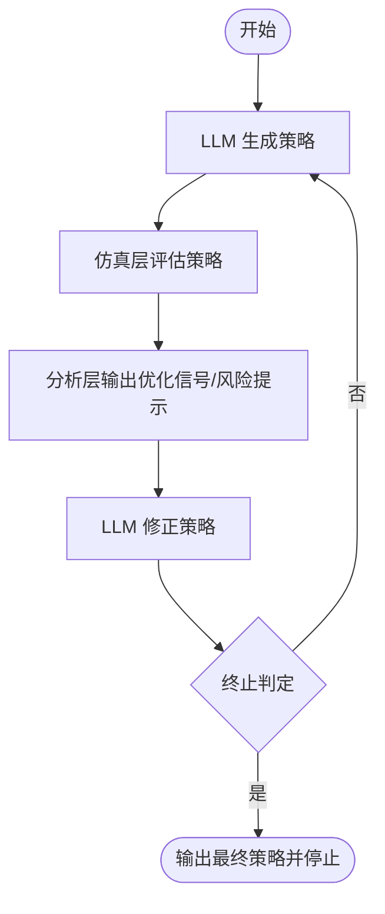
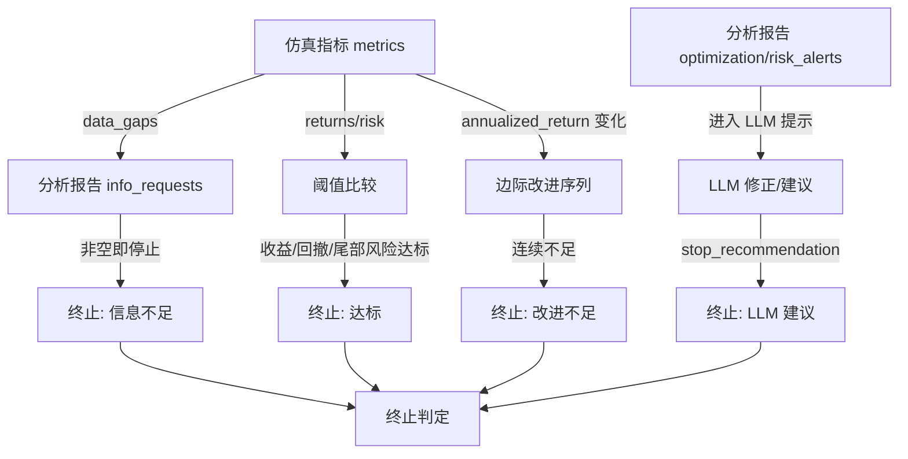

# 商业模拟系统项目手册（简版）

本手册覆盖系统目标、模块、运行方式、配置字段与输出内容，面向快速上手与交付。

## 1. 系统目标
- 基于 LLM 生成策略方案。
- 在仿真环境中评估策略表现并产出指标。
- 分析反馈并驱动策略修正，形成闭环迭代。
- 根据终止规则自动判断是否停止。

## 2. 核心模块
- **LLM 层**：生成/修正策略，输出改动理由与停止建议（`llm_loop_system/llm_layer.py`）。
- **仿真层**：执行多场景仿真并输出指标（`llm_loop_system/simulation_layer.py`）。
- **分析层**：将指标转化为优化信号与风险提示（`llm_loop_system/analysis_layer.py`）。
- **终止判定**：基于信息完整性、收益风险阈值与边际改进做停止决策（`llm_loop_system/termination.py`）。
- **循环控制器**：驱动“生成→仿真→分析→修正→终止”流程（`llm_loop_system/loop_controller.py`）。

## 2.1 闭环流程图


## 2.2 终止判定因果关系图


## 2.3 字段样例（节选）
**仿真指标（SimulationResult.metrics）**
```json
{
  "returns_metrics": {
    "annualized_return": 0.084,
    "monthly_return_avg": 0.007,
    "sharpe_ratio": 0.92
  },
  "risk_metrics": {
    "max_drawdown": -0.12,
    "tail_risk_95": -0.04,
    "loss_distribution": {"p10": -0.02, "p50": 0.006, "p90": 0.03}
  },
  "robustness_metrics": {
    "scenario_consistency": 0.68
  }
}
```

**分析报告（AnalysisReport）**
```json
{
  "analysis_summary": "收益未达标，需要提升收益。",
  "optimization_signals": ["提升收益率", "提升压力场景稳健性"],
  "risk_alerts": ["最大回撤超限"],
  "info_requests": ["补充交易成本假设"]
}
```

**终止判定（TerminationDecision）**
```json
{
  "stop_decision": true,
  "stop_reason": "信息不足，需要补充数据",
  "required_info": ["补充交易成本假设"]
}
```

## 3. 快速运行
```bash
python -m llm_loop_system.run_simulation
```
运行后会输出每轮迭代的策略、指标、分析与终止决策。

## 4. 关键输入（payload）
在 `llm_loop_system/run_simulation.py` 中可调整：
- `assumptions`：市场假设。
- `strategy_params`：策略初始参数。
- `risk_limits`：目标收益、最大回撤、尾部风险阈值。
- `llm_config`：LLM 配置（`model`、`temperature`，也可通过环境变量 `LLM_MODEL` 覆盖）。
- `simulation_config`：仿真路径数、步数、趋势、方向判断准确率等。
- `simulation_config.data_path`：数据文件路径（如红枣期货期权数据）。

## 5. 终止规则（简述）
满足任一条件即停止：
- 信息不足：分析层返回 `info_requests` 非空。
- LLM 建议停止：`stop_recommendation.should_stop = true`。
- 指标达标：收益、回撤、尾部风险满足阈值。
- 边际改进不足：连续多轮改进低于阈值。

## 6. 输出内容
循环返回内容包含：
- 每轮迭代策略、指标、分析摘要、终止判定。
- 最终策略（`final_strategy`）。

## 7. 常见操作
- **调参**：修改 `strategy_params` 或 `simulation_config`。
- **变更迭代上限**：`LoopConfig(max_iterations=...)`。
- **调整终止容忍度**：`LoopConfig(improvement_threshold, max_no_improve_rounds)`。
